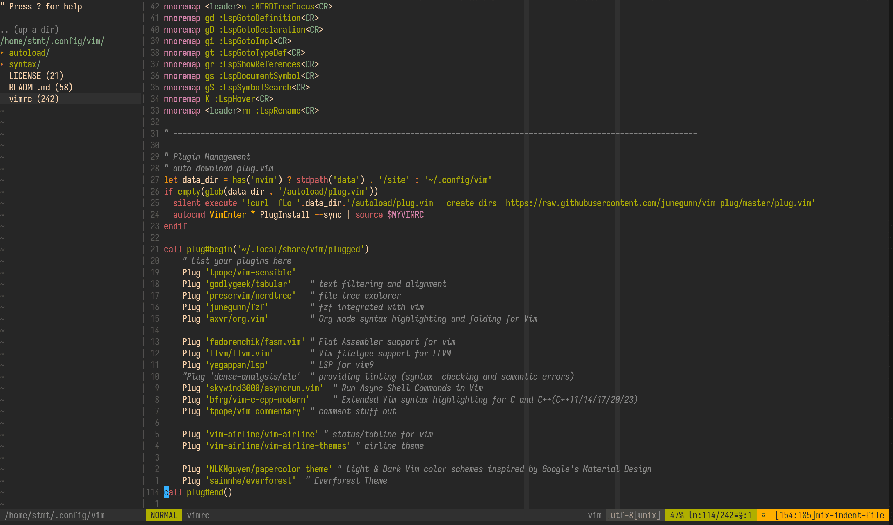

# Dotfiles --- Vim text editor



```sh
# Backup/Rename
[ -d $HOME/.vim ] && mv $HOME/.vim $HOME/.vim.bak
[ -f $HOME/.vimrc ] && mv $HOME/.vimrc $HOME/.vimrc.bak

[ -d $HOME/.config/vim ] && mv $HOME/.config/vim $HOME/.config/vim.bak
```

```sh
# See https://github.com/vim/vim/commit/c9df1fb35a1866901c32df37dd39c8b39dbdb64a

# Base on XDG Spec (Recommanded)
mkdir -p $HOME/.config/vim
git clone https://github.com/range4-skyz/vim $HOME/.config/vim

# These files can be deleted after installation.
rm -r README.md LICENSE assets/ .git/ .gitignore
```

## Installed Plugins

> [!NOTE]
> If this is your first time installing, starting vim will automatically install `plug.vim` to `$HOME/.config/vim/autoload/`.
> Then Enter `:PlugInstall` to install the plugins in vim.

- File explorer
  - [preservim/nerdtree](https://github.com/preservim/nerdtree): A tree explorer plugin for vim.
- Status line:
  - [vim-airline/vim-airline](https://github.com/vim-airline/vim-airline): lean & mean status/tabline for vim that's light as air.
  - [vim-airline/vim-airline-themes](https://github.com/vim-airline/vim-airline-themes): A collection of themes for vim-airline.
- Theme:
  - [sainnhe/everforest](https://github.com/sainnhe/everforest):  Comfortable & Pleasant Color Scheme for Vim.
  - [NLKNguyen/papercolor-theme](https://github.com/NLKNguyen/papercolor-theme): Light & Dark Vim color schemes inspired by Google's Material Design Topics.
- Programming
  - [fedorenchik/fasm.vim](https://github.com/fedorenchik/fasm.vim): FASM (Flat Assembler) support for vim.
  - [llvm/llvm.vim](https://github.com/llvm/llvm.vim): About Vim filetype support for LLVM (mirrored from llvm-project).
  - [yegappan/lsp](https://github.com/yegappan/lsp): LSP plugin for Vim9.
  - [bfrg/vim-c-cpp-modern](https://github.com/bfrg/vim-c-cpp-modern): Extended Vim syntax highlighting for C and C++ (C++11/14/17/20/23).
  - [skywind3000/asyncrun.vim](https://github.com/skywind3000/asyncrun.vim): Run Async Shell Commands in Vim.
  - [tpope/vim-commentary](https://github.com/tpope/vim-commentary): Comment stuff out.
- Integration:
  - [junegunn/fzf](https://github.com/junegunn/fzf.vim): fzf ❤️ vim.
  - [axvr/org.vim](https://github.com/axvr/org.vim): Org mode syntax highlighting and folding for Vim.
- Enhancement:
  - [tpope/vim-sensible](https://github.com/tpope/vim-sensible): Defaults everyone can agree on.
  - [godlygeek/tabular](https://github.com/godlygeek/tabular): Vim script for text filtering and alignment.

## Keybindings

- Leader key: <kbd>Space</kbd>

| Action                    | Key                                        |
| :------------------------ | :----------------------------------------- |
| Open File explorer        |  `leader` + <kbd>n</kbd>                   |

See [vimrc](./vimrc).
